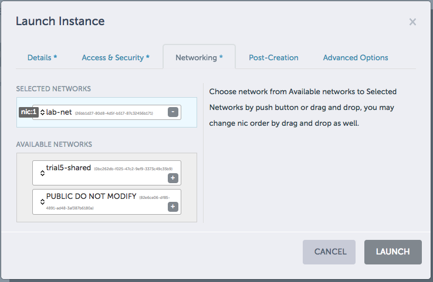
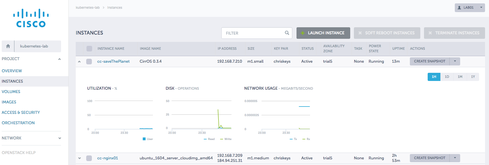

# 0. Metacloud Introduction

### Goals of this lab
In this lab, you will become familiar with the OpenStack UI project, Horizon. We will be using a Metacloud environment for the lab. Metacloud is a private cloud offering based on OpenStack that comes with a 99.99% SLA across the entire stack.

It makes use of the underlying unmodified OpenStack APIs. For the purpose of these labs, Metacloud is just being used as a robust highly available OpenStack cloud. 

More information on Metacloud can be found at [http://www.cisco.com/go/metacloud](http://www.cisco.com/go/metacloud)

###  Login to Metacloud environment
Point your browser towards [https://dashboard-trial5.client.metacloud.net/auth/login/](https://dashboard-trial5.client.metacloud.net/auth/login/) or an alternate location if specified by the instructor

Login as: lab01 / PASSWORD

You will see the following:

The name on the left of the page next to the  is the name of the project or in OpenStack dialect, your **tenant name**.

### Launch a virtual machine (instance)
One of the most common items to do is launch an instance also referred to as a virtual machine.

 * Click **Launch Instance**
 * Provide a unique instance name (**cc_mytestinstance**). Using your initials can help ensure you have a unique name in the class.
 * Select the **m1.small** flavor.
 * Set instance count to **1**
 * Change Instance Boot Source to **Boot from image**
 * Set Image Name to: **CirrOS 0.3.4**
 * Notice the project limit and flavor details to the right side and how they update as you change values
 * Now click  **Access & Security** tab at the top
 

 * Select a keypair. This can be used to restrict access to a running instance so one cannot login with just the username and password. This is not important for this lab, since we will be connecting to the console session so any key will do.
 * Select the **default** security group
 * Now click the **Networking** tab

 * Click the **+** next to lab-network so that this instance is launched on the private network, **lab-net**.

 In OpenStack with Neutron networking, it isn't possible to put a VM directly on a public network where it is reachable. To connect to it, it must be on a private network and then have a floating IP attached to it. OpenStack NATs this floating IP to the private IP on the backend.
 
 Provider Networks in OpenStack allow for a VM to be put directly on a network that is reachable.
 
 * Click **Launch**
 
### Explore the instance

 * You will be taken to the Instances page displaying all running virtual machines within the project. Look to see if your instance is running.
 * Click the name of the instance on the left.
 * Explore the various tabs at the top: **Overview, Log, Console, Action Log**.
 * Select the **Console** tab and then right click **Click here to show only console** and select the option to **Open link in new tab**.
 * Login to the instance using the credentials in the display **(cirros / cubswin!)**. This has actually been the default password for Cirros... yes even before the 2016 World Series!
 * Revert back to the other Metacloud tab in your browser.
 * Click the **Instances** link at the left.  
  
   
 
 * Click the arrow to the left of your instance to reveal some detailed statistics about the running instance. There is likely not a lot of information available since the instance was recently launched.
 * Click the arrow at the far right of your instance and familiarize yourself with some of the options available for this instance.

### Review
You have just spun up an instance and familiarized yourself with some of the basic operations in the OpenStack Horizon UI. Take the opportunity to click around and explore. OpenStack is powered by a rich set of APIs which can be accessed a number of different ways including CURL o the OpenStack CLI. In this lab, we accessed the APIs via the Horizon UI dashboard. 

For the remaining labs, [Terraform](www.terraform.io) will be used to interact with the underlying OpenStack APIs. This allows us to interact with the cloud in a rapid, predictable and reliable manner compared to clicking in a web interface.

To put all this in further context, the following labs will use Terraform to interface with the OpenStack APIs. Instances (VMs) will be created automatically. These instances will be referred to as *nodes* in Kubernetes. Pods will then be deployed on these nodes.

**Please delete/terminate your instance when you are finished.**
