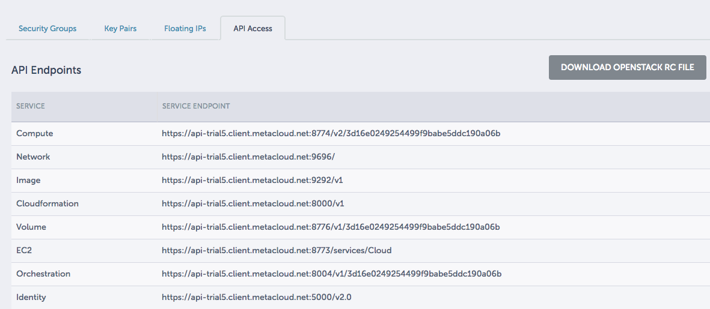

# 1. Environment Setup

In this lab you will use an already created VM preloaded with all of the necessary tools required for the labs. Whilst operating a production cluster, it is likely you may have the tools loaded on another machine. Follow the appendix for some details on how to setup that environment. For this lab this lab, you will use the provided VM.

## Using the Lab Machines

The instructor will provide you with access to the machines where all work will take place. It is recommended to print the accompanying [reference.md](../reference.md) and fill in as you populate variables during the labs. 

```bash
ssh <username>@<ip>
```
The password is ```Cisco.123```


## Access the Cloud

First we need to setup access to the cloud environment. Typically this could be AWS, GCE, or OpenStack. For these labs, we will be using Cisco's OpenStack solution, Metacloud. You should have just familiarized yourself with Metacloud in the previous lab.

### Setup OpenStack Environment Variables

You can log into the OpenStack cluster at [https://dashboard-trial5.client.metacloud.net/auth/login/](https://dashboard-trial5.client.metacloud.net/auth/login/) with username ```lab01``` and password: ```PASSWORD```.

Set the following in your ```~/.profile``` file. This information will be read in by the OpenStack CLI client so that it can properly connect to the OpenStack cloud.

```bash
export OS_AUTH_URL=<Metacloud>
export OS_TENANT_ID=<Tenant ID>
export OS_TENANT_NAME=<Tenant Name>
export OS_USERNAME="lab01"
export OS_PASSWORD="PASSWORD"
export OS_REGION_NAME="RegionOne"
export OS_VOLUME_API_VERSION=1
export OS_IMAGE_API_VERSION=1
export OS_IMAGE_URL=<Image URL>
```

To get some of these variables you will need to log into Metacloud and look at the **Access & Security** section for the project and examine the API section. Note the **Download OpenStack RC** link at the top right of the image below. This contains all of the environment variables you need for your OpenStack environment. In this lab, we have already provided you with the .profile mostly filled out.



  * **HINT:** For the AUTH_URL look at the Identity section in the API list 
  * The tenant_id or project ID can be accessed from the Network >> Network >> lab-net section in the Horizon dashboard
  * The tenant name will be the same as the OpenStack project you are working in.
  * Be sure to replace all variables that need to be set (contained beetwen "< >")
  * Syntax-wise, there should be no remaining < or  >'s

Your file should look similar to the one below:

```bash
export OS_AUTH_URL=https://youshouldhavefoundme/v2.0
export OS_TENANT_ID=1234567890
export OS_TENANT_NAME=kubernetes-lab
export OS_USERNAME="lab01"
export OS_PASSWORD="PASSWORD"
export OS_REGION_NAME="RegionOne"
export OS_VOLUME_API_VERSION=1
export OS_IMAGE_API_VERSION=1
export OS_IMAGE_URL=https://youshouldhavefoundmetoo/v1

```  

Source this file: 

```
. ~/.profile
```
Now these variables will be active anytime you log into the virtual machine. Test to make sure it works. 

```
openstack server list
```
You should see a list of virtual machines running under this tenant with corresponding information.

### Caveats for Liberty OpenStack builds
The following exceptions are noted for using Liberty with Terraform.  The file that is downloaded from the Horizon dashboard will need a few other environment variables set:

```
export OS_AUTH_URL=https://<given url>:5000/v3
export OS_DOMAIN_NAME="<domain name>"
```

### Get Source Files

To obtain all the necessary files for working on these labs, you will clone the git repo. From your home directory run the following command.

```
git clone https://github.com/CiscoCloud/k8sclass.git
```

You should now have everything you need to do the first lab and install your kubernetes cluster!

You can now move on to the [Installation Lab](https://github.com/CiscoCloud/k8sclass/blob/master/02-Install/README.md)


# Appendix: Setting your own Environment

If you decide to do this on your own laptop you will need the following installed: 

* Terraform
* OpenStack Client
* Git
* Cloudflare Binaries
* Kubectl binary (1.4)

If you have issues with any of these tools, check to make sure you are at a current version.  

### Setting up environment on Ubuntu

The following instructions are for setting up the lab environment: 

#### Create Users

```
for i in $(seq 9); do useradd -m -G sudo -p $(openssl passwd -1 Cisco.123) -s /bin/bash user0$i; done
```

#### Get OpenStack Client

```
apt-get update
apt install python-pip
pip install --upgrade pip
pip install python-openstackclient
```
_Note:_ when the python-openstackclient is installed it installs the other OpenStack clients, but doesn't install the clients for them, so you can't run commands like ```neutron```.  Instead the commands all run through running the ```openstack``` command.  

#### Get Terraform 

```
wget https://releases.hashicorp.com/terraform/0.8.4/terraform_0.8.4_linux_amd64.zip
apt-get install -y unzip
mv terraform /usr/local/bin/
```

#### Get Cloudflare Binaries

```
wget https://pkg.cfssl.org/R1.2/cfssl_linux-amd64
chmod +x cfssl_linux-amd64
sudo mv cfssl_linux-amd64 /usr/local/bin/cfssl
```

```
wget https://pkg.cfssl.org/R1.2/cfssljson_linux-amd64
chmod +x cfssljson_linux-amd64
sudo mv cfssljson_linux-amd64 /usr/local/bin/cfssljson
```

#### Get Kubernetes Binary

```
wget https://storage.googleapis.com/kubernetes-release/release/v1.4.0/bin/linux/amd64/kubectl
chmod +x kubectl
sudo mv kubectl /usr/local/bin
```

When you have these components you are now ready to setup your environment as specified in the beginning of this lab.
