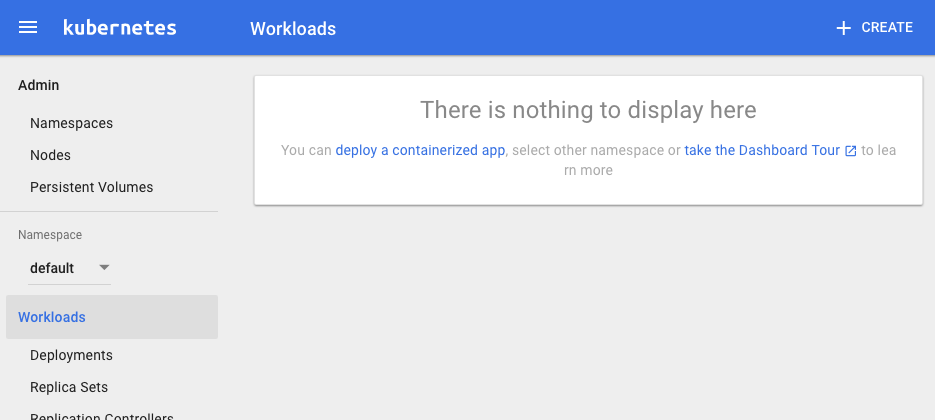

# 3. Configure Kubernetes

The previous lab just did all the set up for you to install Kubernetes, but there are a few remaining steps.

### Verify Installation

Our Kubernetes cluster is front-ended by an nginx reverse proxy load balancer that uses the 3 controllers.  

Remember in the last lab that you named your load balancer?  What was the name?  Whatever it was, the terraform script added a ```01``` to the end of it.  So if you named your load-balancer ```cc-lb``` the name you need is ```cc-lb01```. You can also see all of your instances from the **instances** page in the Metacloud Horizon dashboard.


Once you know this, run the following commands substituting <lb> in with your load balancer name (like ```cc-lb01```).

```bash
export LB=<your loadbalancer>
export CLUSTER_IP=$(openstack server list | grep -i $LB \
	 | awk -F"|" '{print $5}' | awk -F, '{print $2}' | xargs)
echo $CLUSTER_IP
```

Make sure that last command returns an IP address. This is the floating (external) IP address of the load balancer.  If you have trouble, you can run the ```openstack server list``` command and look for the floating IP address assigned to your load balancer. This can also be gathered from the Metacloud dashboard.

### Log into load balancer

From the existing terminal session (on lab VM) run:
```bash
ssh -i ~/.ssh/<keyname>.pem ubuntu@$CLUSTER_IP
```
When you login you should see the SSH key sitting there.  Verify that your ```/etc/hosts``` file includes all the names of your nodes.  

Log into one of your controller nodes to confirm if the other nodes are up: 

```bash
ssh -i ~/<keyname>.pem <controller0X>
```
e.g:

```
ssh -i ~/captaincloudskey.pem cc-kube-controller02
```

Once logged in see if nodes are up: 

```bash
ubuntu@cc-kube-controller02:~$ kubectl get nodes
NAME              STATUS    AGE
cc-kube-worker01   Ready     4h
cc-kube-worker02   Ready     4h
cc-kube-worker03   Ready     4h
```

If the nodes are up and ready you can move to the next step!

### kubectl

```kubectl``` is the command we use to communicate with our Kubernetes cluster.  It was installed on the controller nodes, but now you need it to work from your lab VM. 

To set up ```kubectl``` so it can communicate with the cluster we will follow the instructions from [Kelsey Hightower's Kuberentes The Hard Way](https://github.com/kelseyhightower/kubernetes-the-hard-way/blob/master/docs/06-kubectl.md)

**Log off of from the controller nodes to do the following. You may also need to log off of the load balancer node**

#### Give Cluster a name
Name your cluster something fun.  You'll have to look in your ```metacloud.tf``` file and try to match this.  (It doesn't have to, but its a good idea).  Hint:  ```grep cluster_name metacloud.tf | grep variable``` to get the name. 


```bash
export CLUSTER=<cluster_name>
```
Now let's configure ```kubectl```

```bash
user04@lab01:~/k8sclass/02-Install/Terraform$ pwd
/home/user04/k8sclass/02-Install/Terraform

cd certs/
kubectl config set-cluster $CLUSTER --server=https://$CLUSTER_IP --certificate-authority=ca.pem --embed-certs=true
```

Remember the token we set in the Terraform file?  You can fish that (hint: ```grep token metacloud.tf | grep variable```) out and run the following command so we can speak with that cluster:

```bash
kubectl config set-credentials admin --token <token>
kubectl config set-context default-context --cluster=$CLUSTER --user=admin
kubectl config use-context default-context
```

You should be able to connect from your lab VM to the kubernetes cluster through the nginx load balancer:

```bash
kubectl get componentstatuses
NAME                 STATUS    MESSAGE              ERROR
controller-manager   Healthy   ok                   
scheduler            Healthy   ok                   
etcd-0               Healthy   {"health": "true"}   
etcd-2               Healthy   {"health": "true"}   
etcd-1               Healthy   {"health": "true"}
kubectl get nodes
NAME        STATUS    AGE
kworker01   Ready     1h
kworker02   Ready     1h
kworker03   Ready     1h
```

[More source info](http://kubernetes.io/docs/user-guide/kubectl-cheatsheet/)

Now you are set up to talk to the kubernetes cluster from your lab host!

### Configure overlay networking

In most of the Kubernetes guides you'll find recommendations to use Weave, Flannel, Calico, or some other networking overlay.  With OpenStack, we already have a network overlay called neutron, so we'll use it!

This method is also similar to using bare metal Kubernetes where there is a simple network switch connecting all nodes. 

(Note: For other information on this section see [this excellent blog post](http://blogs.cisco.com/cloud/deploy-a-kubernetes-cluster-on-openstack-using-ansible))

We'll have to first define our static routes.  To get these static routes we have a quick script for you to run.  Run the command:

```bash
cd ~/k8sclass/02-Install/Terraform/
./generate-neutron-routes.py
```

This gives us output like: 

```bash
neutron port-update 3325e20d-29b0-4da7-ac2f-5ad54ab390f3 --allowed-address-pairs type=dict list=true ip_address=10.204.0.0/24
neutron port-update 9958fc43-075d-4577-9374-467c21c19371 --allowed-address-pairs type=dict list=true ip_address=10.204.1.0/24
neutron port-update 550eabc3-df51-4586-9680-b4b3f7279bea --allowed-address-pairs type=dict list=true ip_address=10.204.2.0/24
```


These are the OpenStack commands that need to be run to enable the routes for your Kubernetes cluster.  Since your OpenStack user doesn't have the ability to run these commands, **you'll have to get these commands to the instructor so they can run them**. The instructor will mention the best way to do this (probably the [Spark](http://web.ciscospark.com) room that was setup at the beginning of class).

Once they run these commands they will let you know and you can move on!  Maybe, now is a good time to go get some coffee while you wait.

#### Troubleshooting ```generate-neutron-routes.py```
Did the script not work?  So sorry to hear that!  I guess you're just never going to finish this lab.  Just kidding!  There may be a bug!  Let us know and we can help you!

### Kubernetes DNS

From our lab host we can now run the following commands to get kubernetes DNS running on our cluster: 

```bash
kubectl create -f https://raw.githubusercontent.com/CiscoCloud/k8sclass/master/03-Config/services/kubedns.yaml
```
This creates a service called kube-dns.  What it will do is look for any pods with app name = kube-dns.  Then it will open up IP address ```10.32.0.10``` to them. You can read more about Kubernetes services [here](http://kubernetes.io/docs/user-guide/services/)

Now you can run the command: 

```kubectl --namespace=kube-system get svc```

Next we will create the DNS deployment.  This is where we will actually build several containers with kubernetes.  

Run the command: 

```kubectl create -f https://raw.githubusercontent.com/CiscoCloud/k8sclass/master/03-Config/deployments/kubedns.yaml```

Kubernetes reads the file and deploys containers based on what it says to do.  You can [look at the file here](https://github.com/CiscoCloud/k8sclass/blob/master/03-Config/deployments/kubedns.yaml).  Notice that the ```kind``` is ```Deployment```.  There are three container images specified that will be deployed:  ```kubedns```, ```dnsmasq```, and ```healthz```.  These containers will all be deployed in a single pod.  Line 25 also shows that two of these pods will be created.  

Check that services are now up.

```bash
kubectl --namespace=kube-system get deployments
kubectl --namespace=kube-system get svc
kubectl --namespace=kube-system get pods -o wide
```
If all goes well that last command should give you output similar to: 

```bash
NAME                            READY     STATUS    RESTARTS   AGE       IP           NODE
kube-dns-v20-1485703853-7y7o6   3/3       Running   0          50s       10.214.0.2   cc-kube-worker01
kube-dns-v20-1485703853-j6dh7   3/3       Running   0          50s       10.214.2.2   cc-kube-worker03

```

Hurray!  Now kubedns is up!

### Kubernetes Dashboard


We have been interacting with the cluster via kubectl. It can be nice to have a visual dashboard as well, so lets install one! First we will install the dashboard as a basic deployment (e.g: Pods): 

```bash
kubectl create -f https://raw.githubusercontent.com/CiscoCloud/k8sclass/master/03-Config/deployments/kubernetes-dashboard.yaml
```

Make sure its up:

```bash
$ kubectl get pods -n kube-system
NAME                                    READY     STATUS    RESTARTS   AGE
kube-dns-v20-1485703853-oc6hj           3/3       Running   0          3m
kube-dns-v20-1485703853-pp1ko           3/3       Running   0          3m
kubernetes-dashboard-3203700628-5zhl8   1/1       Running   0          12s
```

Now, how can we access this dashboard externally?  By default, these services are not exposed outside the cluster.  What we can do is create a service from this deployment.  

Download a template file running: 

```
wget https://raw.githubusercontent.com/CiscoCloud/k8sclass/master/03-Config/services/dashboard.yaml
```

Edit this file.  You will see that there are three places where you can add your worker node IP addresses:

```yaml
...
 externalIPs:
  - <worker1 IP address>
  - <worker2 IP address>
  - <worker3 IP address>
...
```

Substitute the values of your worker IP addresses.  You can get the IP addresses in the ```hostfile``` in the same directory where the ```metacloud.tf``` file is or use the ```openstack server list``` command. 

When completed it should look something like this: 

```yaml
...
 externalIPs:
  - 192.168.7.107
  - 192.168.7.105
  - 192.168.7.110
...
```

Now you can deploy this service: 

```kubectl create -f dashboard.yaml```

(make sure you run that command in the same directory where the ```dashboard.yaml``` file is that you just edited!)

If all went well, you should be able to see the service running: 

```bash
kubectl get svc -n kube-system
NAME                   CLUSTER-IP   EXTERNAL-IP                                 PORT(S)         AGE
kube-dns               10.32.0.10   <none>                                      53/UDP,53/TCP   6h
kubernetes-dashboard   10.32.0.11   192.168.7.107,192.168.7.105,192.168.7.110   9999/TCP        21m
```
Notice that the port that this service exposes is 9999.  If you look in the ```templates/nginx.conf.tpl``` file you'll see that we mapped port ```80``` externally to point to this ```9999``` internal port.  You should now be able to open a web browser and pull up the dashboard: 

```
http://<load-balancer-floating-ip-address>
```
You can find your load balancer IP address from: ``` openstack server list | grep lb ```

You'll then be prompted for a user name and password.  We specified this in the ```metacloud.tf``` file.  (you can see it around line 239 with the ```htpasswd``` command)

```
username: kubeadm
```
```
password: k8sclass
```

If all goes well you should see the dashboard: 




You can now proceed to the [next lab](https://github.com/CiscoCloud/k8sclass/blob/master/04-Running/README.md) to deploy an example application!

## Optional Stuff (feel free to ignore)

(Ignore unless you want to see other ways to communicate with the API server)

### Using Curl to communicate with API server

Kubernetes gives us the ```kubectl``` command but it is just a client for accessing the Kubernetes API server.  We could access it directly with ```curl```. 

Go into the ```certs/``` directory again and run something like: 

```bash
user04@lab01:~/k8sclass/02-Install/Terraform$ cd certs
/home/user04/k8sclass/02-Install/Terraform/certs$ curl --cacert kubernetes.pem -H "Authorization: Bearer <token>" https://<lb-public-ip>/api/v1/pods
```

Where ```<token>``` is what you defined in the ```metacloud.tf``` file and used in previous steps. 

This mimics to some extent what kubectl is doing.  We use the token and the certificate to authenticate with the API server.  This isn't the dashboard, this is simply the API. 

#### Using Kubectl proxy to access the API server

If we didn't have nginx front loading and providing us a way into the cluster we could proxy into the lab.  Running the command: 

```
kubectl proxy -n <port>
```
Where port = 8000 + <your lab group>, e.g.: 8001, 8002, ...

This will open port 800X that lets you access the dashboard via the web interface at ```https://localhost:800X/api/v1/pods```.  


