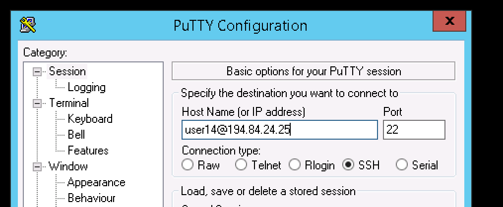

# SEVT: Login Lab

## 0. Goals
We want to give you hands on experience with Kubernetes!  But we don't want to mess around with your individual laptop.  For this reason we want you to do all the exercises on our lab machines we've created for you.  

Later after this is done, you can try to get kubectl working on your own laptop.  

## 1. Sign up for a lab machine
Go to [the internal etherpad](http://etherpad.ctocllab.cisco.com/p/kubeclass) site and select any unused user account on one of the machines.  This will be the machine you will use to complete the labs. 

For example, you may select user2108 on lab machine 208.49.34.2 and your name might be Jane Doe.  In this case, you just write your name next to the machine name. 


__Note:__ this is an example only and may not be what is up on etherpad

## 2. Log into the lab machine

Once you have selected a lab machine from the etherpad, log into the lab machine: 

### From Mac or Linux
Open the terminal and run:

```
ssh user215@208.49.34.2
```
### From Windows

Use [PuTTY](http://www.putty.org/) to login: 




The password for all lab machines will be in the spark room. 

You are done!  [Go back to main class page](README.md)