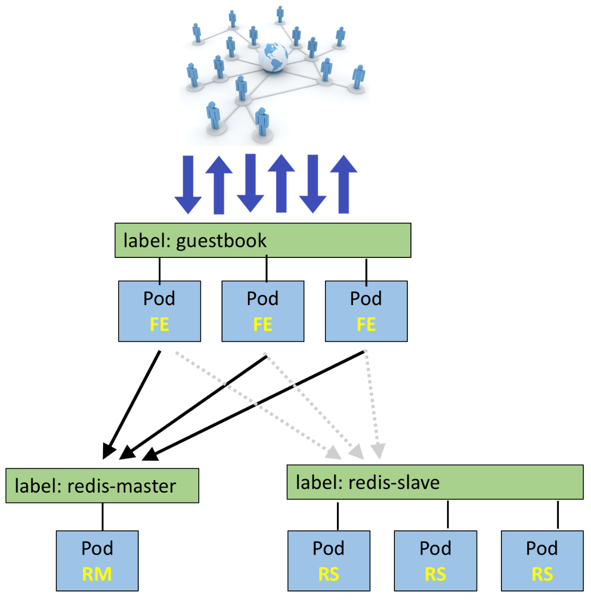
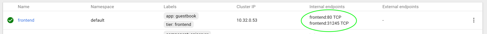
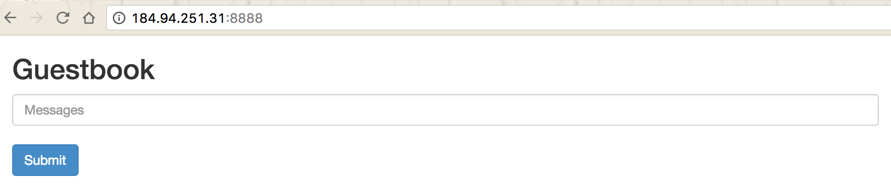

# Guestbook

## 0. Goals
The goals of this lab is to help you be familiar with basic kubernetes operations for application lifecycle.  This includes deployment, scaling, and upgrading.

For this lab we will use a common guestbook application. The architecture in the end will look like the following:



This is an ideal application as it contains various components including:

 * a single node deployment
 * a multi-node deployment
 * a replication controller to ensure some components continue to run
 * a web front-end and backend DB
 * test 

This lab will flow as follows:
 
1. redis-master deployment
2. Create redis-master service and pods
3. Deploy redis-slave deployment, service, and pods
4. Ceate frontend deployment
5. Expose frontend using kubectl command
6. View your application
 
For this lab, we will be using the Guestbook example which is modeled after [this](https://github.com/kubernetes/kubernetes/tree/master/examples/guestbook)

A preferred way involves maintaining yaml/json files in a repository and then easily pushing those files to Kubernetes. This avoids typos and allows for great detail tracking versions of files which can be 
useful to rollback or debug an application.

As such there are a few different ways we could deploy the guestbook application. For example, we could deploy the entire guestbook application including frontend servers, redis master and slaves by deploying a single YAML file! We don't  want to let you off that easy though. For this reason, we will deploy each component and walk through it separately. 

This guestbook is nice as it has many components.
Review the diagram at the beginning of this lab

 * frontend: a multi-pod deployment with a service in front. This is a nginx web server to access the guestbook.
 * redis-master: a single-pod deployment with a service in front. This is used for persistant storage. 
 * redis-slave: a multi-pod deployment with a service in front. Data from the redis-master is replicated on the slaves

The frontend will be accessible by anyone on the Internet. The frontend then interacts with the redis-master via javascript redis API calls. 

 
## 1. Redis Master Deployment 
 
The frontend will be communicating with the redis-master to store and retrieve data.
 
The redis-master deployment file can be found in the [04-Running/guestbook/](https://github.com/CiscoCloud/k8sclass/tree/master/04-Running/guestbook) folder of this repository. 

```yaml
apiVersion: extensions/v1beta1
kind: Deployment
metadata:
  name: redis-master
  # these labels can be applied automatically 
  # from the labels in the pod template if not set
  # labels:
  #   app: redis
  #   role: master
  #   tier: backend
  #   exercise: lab3
spec:
  # this replicas value is default
  # modify it according to your case
  replicas: 1
  # selector can be applied automatically 
  # from the labels in the pod template if not set
  # selector:
  #   matchLabels:
  #     app: guestbook
  #     role: master
  #     tier: backend
  template:
    metadata:
      labels:
        app: redis
        role: master
        tier: backend
        exercise: lab3
    spec:
      containers:
      - name: master
        image: gcr.io/google_containers/redis:e2e  # or just image: redis
        resources:
          requests:
            cpu: 100m
            memory: 100Mi
        ports:
        - containerPort: 6379
```

Examining this deployment file we notice a few things:

 * The kind is set to **deployment**
 * replicas is set to 1. This means that if the pod dies, an another will automatically be spun up by Kubernetes.
 * There are various labels set.
 * In the container section, it lists the source for the redis image as well as some requests for resources

Create the deployment with the following command: 

```bash
kubectl create -f https://raw.githubusercontent.com/CiscoCloud/k8sclass/master/04-Running/guestbook/redis-master-deployment.yaml
```

 We can confirm our redis-master was deployed successfully by running some additional commands:
 
```bash
kubectl get deployments
kubectl get replicasets
kubectl get pods
```

Notice the naming of the deployment, replicaset, and pod. The pod name is the most detailed. By adding this single YAML file we created a deployment which consisted of a replicatset with a single pod.

You can describe this pod to see additional details after it has been deployed.

```
kubectl describe pods redis-master-<some-random-string>
```
Where ```<some-random-string>``` is the name of the pod you saw while running the ```kubectl get pods``` command. 

Check out the logs for this container, you can do the following:

```
kubectl logs redis-master-<some-random-string>
```

## 2. Redis Master Service

As it stands, redis-master has been deployed to a single pod which contains an IP. If there is an issue with this pod, the replication controller will ensure that it spins up again. However, it could now spin up in a different pod or even on a different host. This will result in a new IP address. Because we will have other components talking to this, we can create a service so that other components can reach this service via its service name. This ensures that we always have a way to talk to it.

We already have a [redis-master-service.yaml](https://github.com/CiscoCloud/k8sclass/blob/master/04-Running/guestbook/redis-master-service.yaml) for you:

```yaml
apiVersion: v1
kind: Service
metadata:
  name: redis-master
  labels:
    app: redis
    role: master
    tier: backend
    exercise: lab3
spec:
  ports:
    # the port that this service should serve on
  - port: 6379
    targetPort: 6379
  selector:
    app: redis
    role: master
    tier: backend
```

Note this service file is pretty simple. Its kind is a service with a name of <b>redis-master.</b>

Create this service using the command below (similar to how we created the deployment)

```bash
kubectl create -f https://raw.githubusercontent.com/CiscoCloud/k8sclass/master/04-Running/guestbook/redis-master-service.yaml 
```


## 3. Redis Slave Deployment 

Since we are building a cloudy guestbook, we want to do everything we can do to ensure that our application is resilient across various failures. For this reason, we will create a redis-slave deployment. The data in the redis-master will be synced to the data in the redis-slave deployment.

Similar to the redis-master deployment, we already have a deployment file for the redis-slave.

Examine [redis-slave.yaml](https://github.com/CiscoCloud/k8sclass/blob/master/04-Running/guestbook/redis-slave.yaml) closely.

Hopefully you noticed a few things:

 * There is a service defined at the top of the file called **redis-slave**
 * There is also a deployment defined beneath this service
 * Replicas is set to 2 for this. This will ensure that there are always 2 redis-slaves running. 

You are almost a pro at this, go ahead and create the redis-slave service as shown below:

```bash
kubectl create -f https://raw.githubusercontent.com/CiscoCloud/k8sclass/master/04-Running/guestbook/redis-slave.yaml 
```

Notice how both a service and deployment were both created for us!

Now lets see what pods are running.

```bash
kubectl get pods
```
You may see that some of the containers are still being created.  Be patient and wait for them to be created!

## 4. Frontend Deployment 

For this guestbook example, we will use a simple PHP server that is configured to talk to redis-master or redis-slave depending if the action if a read or write. We will deploy 3 nginx web server pods in this environment using the [frontend.yaml](https://github.com/CiscoCloud/k8sclass/blob/master/04-Running/guestbook/frontend.yaml). 

Configure the frontend as shown below:

```bash
kubectl create -f https://raw.githubusercontent.com/CiscoCloud/k8sclass/master/04-Running/guestbook/frontend.yaml
```

Confirm that all componenta are up by listing the deployments and replicasets:

```bash
kubectl get deployment,rs
```

If you have noticed, we have been labeling the various components. Examine the pods based on the tier label we have applied:

```bash
kubectl get pods -L tier
```
These pods should reflect the diagram of the deployment at the begining of this lab.

## 5. Frontend Service

You may have also noticed that there is no service for the frontend component. A service will be needed in order to access our guetbook.

You can create a service via the command line by issuing the command 

```
kubectl expose deployment frontend --port=80 --type=NodePort
```

Depending on the environment Kubernetes is running in, there are a number of ways to expose your applications. With some public cloud providers (e.g. Google), you can use a LoadBalancer instead of a NodePort. In this lab, we will expose the service via NodePort. 

You just exposed the frontend deployment as a service of type [NodePort](http://kubernetes.io/docs/user-guide/services/#type-nodeport). To see what port Kubernetes assigned it you can run the command below or check the dashboard under services >> frontend.

```bash
kubectl describe svc frontend
```

You'll see a line similar to:

```
...
NodePort:		<unset>	31245/TCP
...
```
This means that your service is now exposed to that port externally. 



In this example, the NodePort is 31245. 

## 6. View your application

Open a browser to access your guestbook at the URL: ```http://<node IP>:<your port>```

Here ```<node IP>``` is a public IP address exposed from the kubernetes cluster.  This information should be in the spark room. 

```<your port>``` is the port you saw exposed in the previous section.  





You are done!  [Go back to main class page](README.md)
